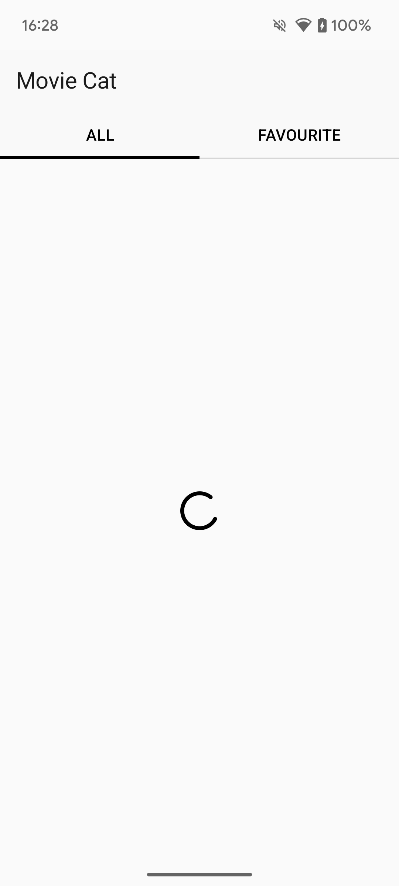
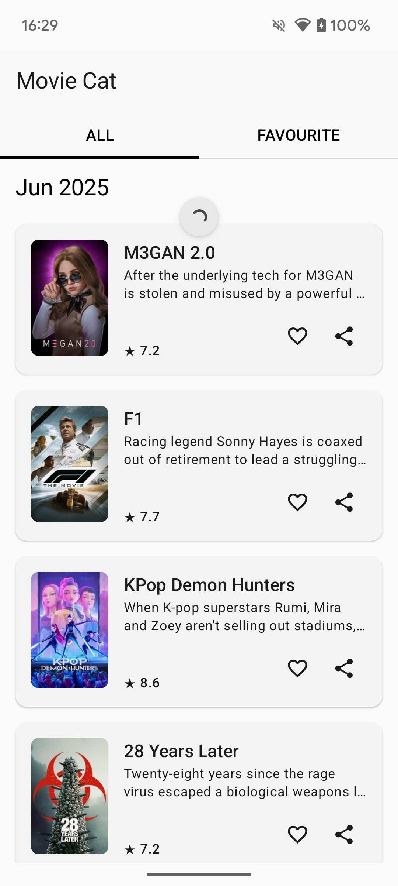
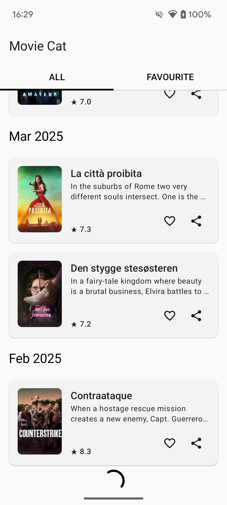
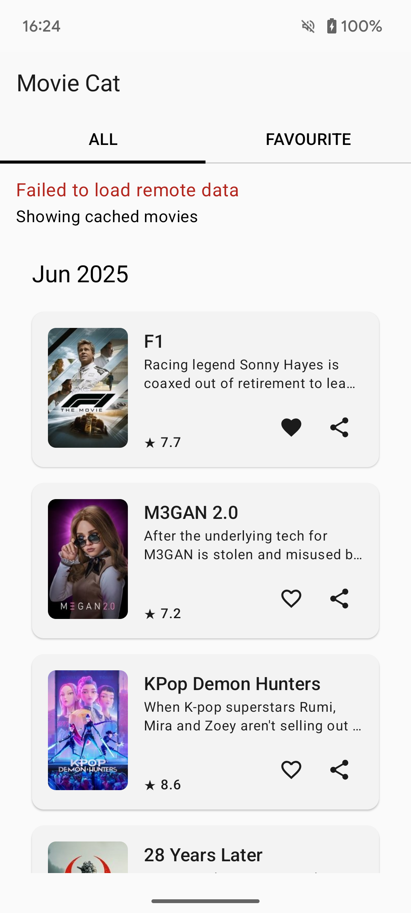
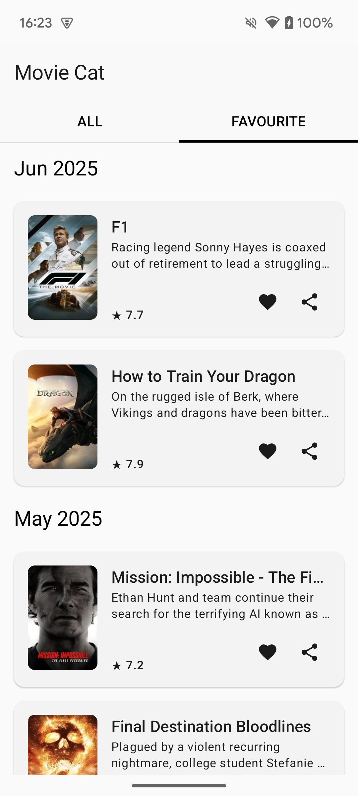
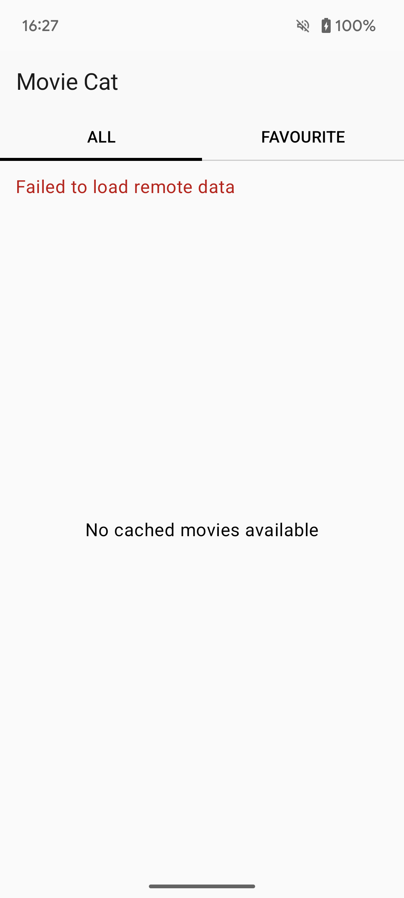
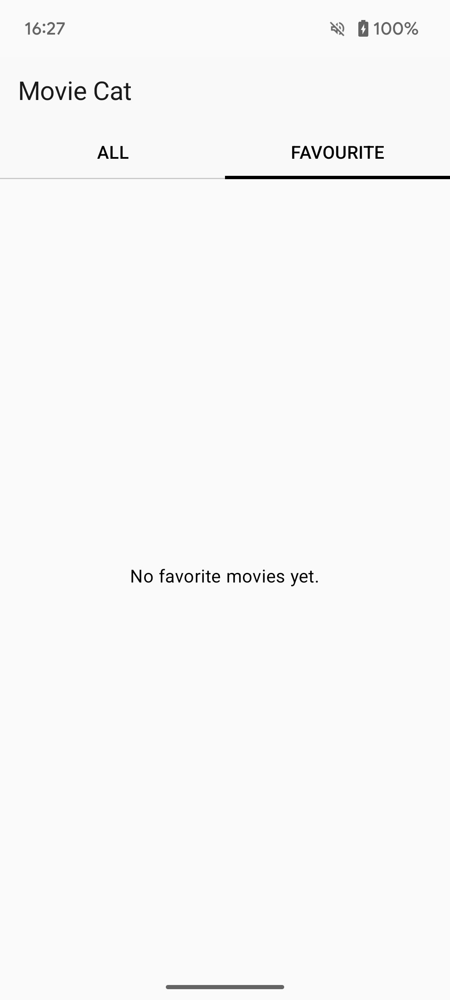

# 🎬 Movie Cat – Android Movie Discovery App

Movie Cat is a modern Android application that allows users to discover, browse, and manage their favorite movies using a clean UI and efficient data loading mechanisms. It supports both online and offline modes with robust caching and favorites functionality.

---

## 📸 Screenshots


### 🔄 Loading States

| Initial Load | Refreshing | Pagination Append |
|--------------|------------|-------------------|
|  |  |  |

---

### 📦 Content States

| Remote Data | Cached Data | Favorites |
|-------------|-------------|-----------|
|  |  |  |

---

### 🚫 Empty States

| All Tab Empty | Favorites Tab Empty |
|---------------|---------------------|
|  |  |

---

## 📐 Architecture Overview

The app is built using **Clean Architecture** principles and modern Android development tools. It separates concerns into well-defined layers:

```
Presentation (UI: Jetpack Compose)
         ↓
Domain (Business Logic, Use Cases, Models)
         ↓
Data (Repositories, Mappers, Data Sources (Remote API, Room))
```

### 🧱 Layers Explained

- **Presentation Layer**
    - Built with **Jetpack Compose**
    - Uses **ViewModel** and **StateFlow** to manage UI state

- **Domain Layer**
    - Defines clean interfaces (`MovieRepository`) and business models (`Movie`)
    - Independent of any framework (pure Kotlin)

- **Data Layer**
    - Implements repository interfaces
    - Handles mapping between DTOs, Entities, and Domain models
    - Bridges remote and local sources transparently
    - **Remote Layer**
        - Uses **Retrofit** to fetch movie data from an API
        - Paginated loading with **Paging 3**
    - **Local Layer**
        - Uses **Room** to store cached movies and user favorites
        - Provides paging and observable flows from DB

---

## 🧠 Design Decisions & Rationale

### 1. Clean Architecture & Separation of Concerns
Promotes testability, modularity, and flexibility. Domain logic can be tested independently of Android or third-party libraries.

### 2. Paging 3 for Infinite Scroll
Reduces memory consumption and supports data source invalidation, retry, and loading states out of the box.

### 3. Flow & StateFlow for Reactive UIs
Jetpack Compose integrates naturally with `StateFlow`, making UI reactive and lifecycle-safe.

### 4. Mappers
Explicit mapping between layers avoids leaking data formats (DTOs/Entities) outside their intended boundaries.

---

## 🧪 Testing

- **Unit Tests**
    - Domain and Data layers are covered using JUnit + MockK
    - Paging data sources and mappers are unit tested

---

## 📁 Project Structure

```
com.zinchuk.moviescatalog
├── data
|   ├── di
│   ├── mappers
│   ├── repositories
│   ├── sources
│   │   ├── remote
│   │   └── local
│
├── domain
│   ├── models
│   ├── repositories
│   └── usecases
│
├── presentation
│   ├── mappers
│   ├── ui
│   │   ├── components
│   │   └── theme
│   ├── screens
│   │   ├── all
│   │   └── favorites
│   └── utils
```

---

## 🧰 Tech Stack

| Tool/Library           | Purpose                           |
|------------------------|-----------------------------------|
| Kotlin                 | Core language                     |
| Jetpack Compose        | UI framework                      |
| Hilt                   | Dependency Injection              |
| Paging 3               | Paginated data loading            |
| Room                   | Local data persistence            |
| Retrofit               | Networking                        |
| Coroutines             | Asynchronous programming          |
| MockK + JUnit          | Testing                           |
| Coil                   | Image loading                     |

---

## 🚀 Getting Started

Open project in Android Studio and use standard build tools.

Alternatively:

```bash
git clone https://github.com/yurii-zinchuk/moviecatalog.git
cd moviecatalog
./gradlew assembleDebug
```

---

## 🔖 TODO / Future Improvements

- [ ] Cache movie posters
- [ ] Dark mode support
- [ ] User registration via Google/Facebook
- [ ] Movie sharing (using existing placeholder buttons)
- [ ] Integratin testing


---


## 🙋‍♂️ Maintainer

Made by [Yurii Zinchuk](https://github.com/yurii-zinchuk)
